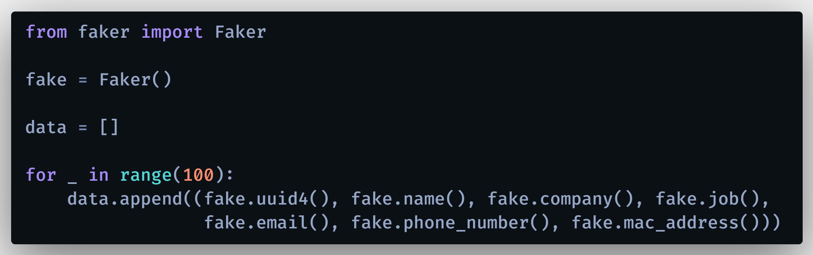
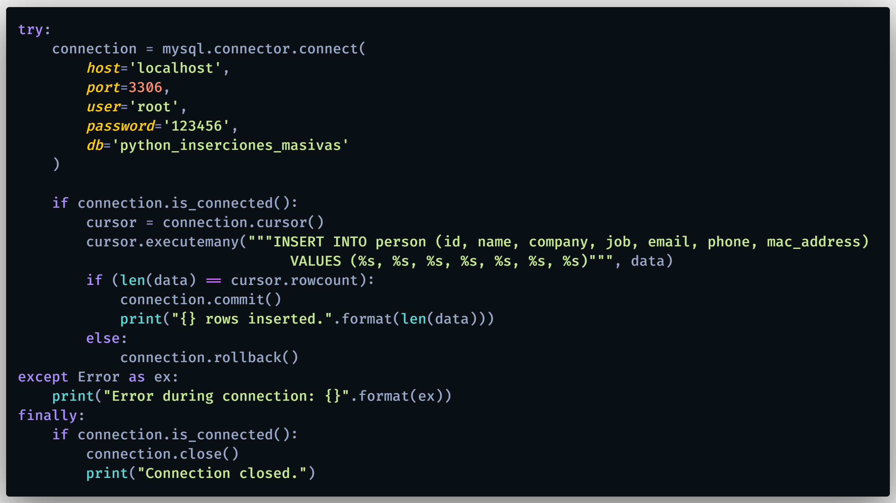
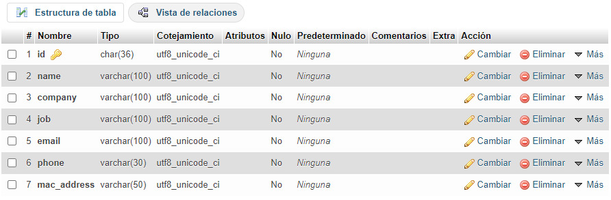
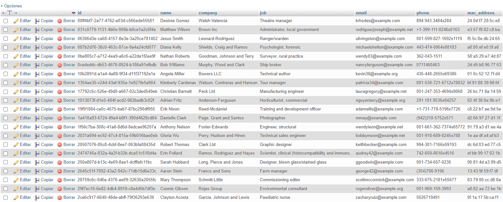

# Python: Inserción masiva de datos (en MySQL) con Python

Aprende a realizar inserciones masivas en una base de datos MySQL usando un script de Python, de una forma fácil, ordenada y funcional. Cónoce cómo generar datos de prueba, aleatorios y estructurados para registrarlos de forma masiva en una tabla perteneciente a una base de datos MySQL.

Primero, crear un entorno virtual:
### `python -m virtualenv venv`

Para instalar los paquetes necesarios:
### `pip install -r requirements.txt`

Documentación Oficial: https://pypi.org/project/Faker/

  

  

  

# 🌍 Por si deseas contactarme 👨‍💻 :

